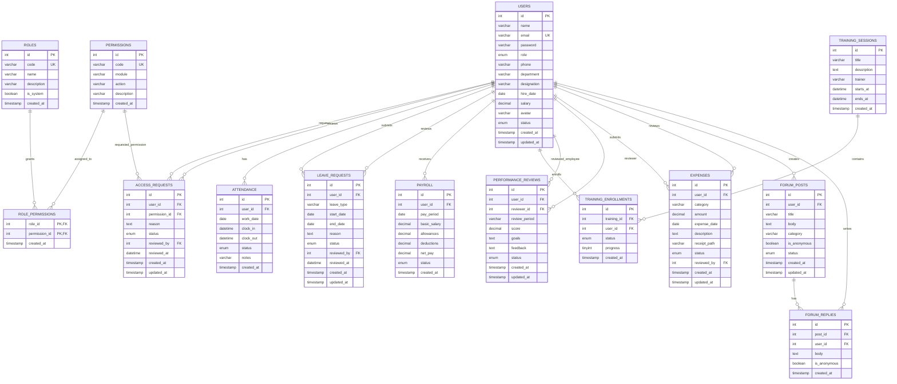

# HRSpace ER Diagram

Note: `users.role` stores the role code (`admin`, `hr_manager`, `employee`) and matches `roles.code`. The `user_permissions` view joins users to roles and permissions for easier authorization checks.
